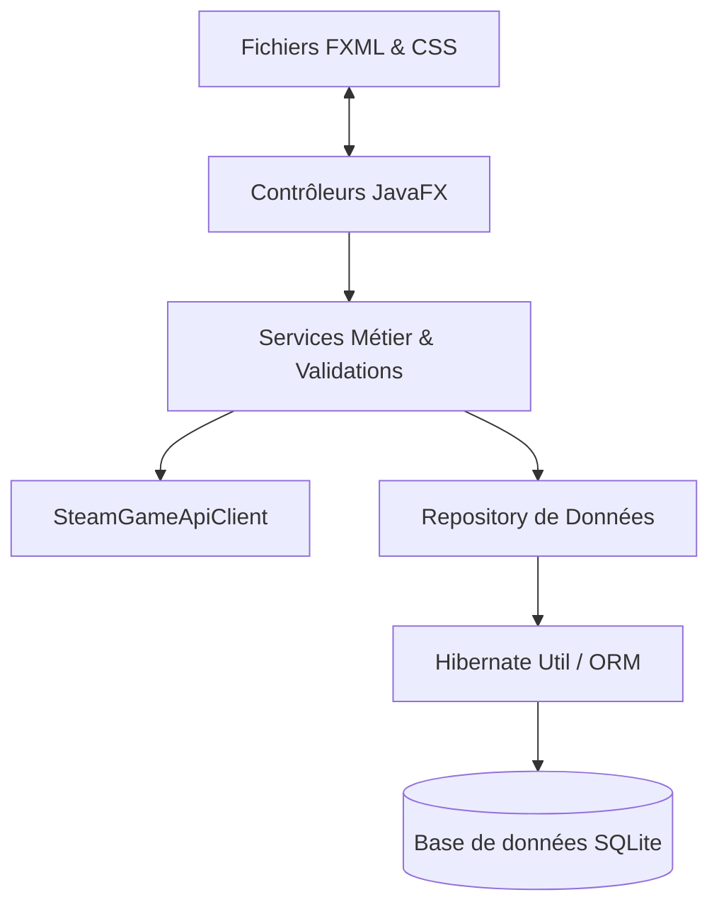

# 🎮 GameVault

[](https://openjdk.org/)
[](https://openjfx.io/)
[?style=for-the-badge&logo=hibernate&logoColor=white)](https://hibernate.org/)
[](https://www.sqlite.org/)
[](https://maven.apache.org/)
[](https://www.figma.com/)

**GameVault** est une application desktop moderne et performante de gestion de bibliothèque de jeux vidéo, spécialement conçue pour répondre aux besoins de l'association **RetroSphere**. Dotée d'une interface utilisateur élégante, réactive et hautement personnalisable, l'application intègre des fonctionnalités avancées de recherche, d'agrégation de données externes et de visualisation statistique.

---

## ✨ Fonctionnalités Principales

*   **🗂️ Bibliothèque Interactive (Bento Grid) :** Présentation sous forme de cartes riches avec couverture visuelle, badges de plateformes, indicateurs de favoris et notes colorées.
*   **🔍 Recherche & Filtrage Avancés :** Recherche en temps réel (titre, développeur, éditeur, plateforme, genre, statut) avec puces de filtrage dynamiques et tris personnalisables (par ajout récent, titre, note, année).
*   **☁️ Intégration Steam API :** Récupération automatique des métadonnées (titre, développeur, éditeur, année, genre, description) et téléchargement de la couverture officielle simplement en saisissant le nom d'un jeu.
*   **📊 Dashboard de Statistiques :** Visualisation des métriques clés de la collection (nombre de jeux, moyenne des notes, répartition par plateforme, etc.) via des graphiques interactifs.
*   **🎨 Personnalisation (Dual Theme) :** Support complet d'un thème sombre immersif (`#0b1326`) et d'un thème clair moderne, avec transition fluide.
*   **💾 Robustesse des Données :** Couche de persistance SQLite gérée via Hibernate ORM avec un mécanisme robuste de validation des données à la saisie.

---

## 🛠️ Stack Technique

| Technologie | Version | Rôle & Description |
| :--- | :---: | :--- |
| **Java** | `21` | Langage principal, tirant parti des dernières fonctionnalités (records, pattern matching). |
| **JavaFX** | `23.0.2` | Framework graphique riche pour la construction de l'interface utilisateur desktop. |
| **FXML** | `2.0` | Structuration déclarative des vues et des layouts graphiques. |
| **CSS (Vanilla)** | `-` | Design système sur mesure avec variables globales (`gamevault.css`), transitions et micro-animations. |
| **Hibernate ORM** | `6.6.4` | Mapping Objet-Relationnel (ORM) pour abstraire la base de données. |
| **SQLite JDBC** | `3.47.1` | Base de données locale légère et embarquée ne nécessitant aucune installation externe. |
| **Steam Store API** | `-` | API publique de Steam pour l'enrichissement automatique des fiches de jeux. |
| **SLF4J** | `2.0.16` | Abstraction de journalisation (logging) pour le suivi technique de l'application. |

---

## 📂 Architecture Logicielle

L'application suit un modèle d'architecture en couches propre, séparant les préoccupations et facilitant la maintenance du code.



### 📁 Structure des Répertoires

```text
src/main/java/fr/retrosphere/gamevault
├── MainApp.java        # Point d'entrée de l'application & initialisation JavaFX
├── config/             # Configuration applicative (lecture de properties)
│   └── AppConfig.java
├── controller/         # Gestionnaires d'événements et liaison UI
│   ├── GameFormController.java
│   └── MainController.java
├── model/              # Entités persistantes JPA/Hibernate
│   └── Game.java
├── persistence/        # Gestion du cycle de vie d'Hibernate
│   └── HibernateUtil.java
├── repository/         # Requêtes et accès directs à la base de données
│   └── GameRepository.java
└── service/            # Logique métier, validation et API externe
    ├── GameService.java
    ├── SteamGameApiClient.java
    ├── GameSeeder.java
    └── DemoCoverGenerator.java
```

---

## 🚀 Installation & Lancement

### Prérequis

*   **Java Development Kit (JDK) 21** ou supérieur.
*   **Apache Maven 3.9** ou supérieur.

### Étapes de configuration

1.  **Cloner le dépôt :**
    ```bash
    git clone https://github.com/votre-compte/ProjetFinalDevDesktop.git
    cd ProjetFinalDevDesktop
    ```

2.  **Lancer l'application en mode développement :**
    ```bash
    mvn clean javafx:run
    ```
    *Au premier lancement, une base de données de démonstration SQLite est automatiquement créée et peuplée dans `data/gamevault.db`.*

3.  **Compiler le package exécutable (JAR) :**
    ```bash
    mvn clean package
    ```

---

## ⚙️ Configuration & Base de Données

Toute la configuration système se trouve dans le fichier :
`src/main/resources/application.properties`

### Paramètres de base de données :
```properties
# Emplacement et driver SQLite
database.url=jdbc:sqlite:data/gamevault.db

# Comportement du schéma Hibernate (update, validate, create-drop)
hibernate.hbm2ddl.auto=update

# Affichage des requêtes SQL dans la console (pour débogage)
hibernate.show_sql=false
```

---

## 🛡️ Validation & Robustesse

Pour garantir l'intégrité de la bibliothèque de RetroSphere, un module de validation strict (`GameService`) intercepte chaque écriture :

*   **Champs Obligatoires :** Un jeu ne peut être sauvegardé sans `titre`, `développeur`, `éditeur` et `plateforme`.
*   **Cohérence Temporelle :** L'année de sortie doit être une valeur réaliste (comprise entre 1950 et l'année en cours).
*   **Notation Standardisée :** La note doit être comprise strictement entre `0` et `10`.
*   **Contrôle Multimédia :** Les couvertures locales doivent être au format `JPG`, `PNG` ou `GIF`.
*   **Sécurité Utilisateur :** Toute suppression de données requiert une double confirmation par boîte de dialogue sécurisée.
*   **Gestion des Erreurs :** En cas d'échec de chargement réseau (ex: Steam API hors ligne), l'application bascule automatiquement sur un mode dégradé gracieux (génération d'une couverture avec initiales stylisées, message d'avertissement non bloquant).

---

## 🎨 Conception Visuelle & Figma

L'interface graphique a été entièrement prototypée sur Figma afin de garantir une expérience utilisateur hautement ergonomique et calibrée pour les écrans HD.

*   🖥️ **Ma Bibliothèque (Bento View) :** [Accéder au Design Figma](https://www.figma.com/design/ec8xxk2sc2PyamQ9Ai7NDa/ProjetDevDesktop?node-id=0-152&m=dev)
*   ➕ **Formulaire d'Ajout / Modification :** [Accéder au Design Figma](https://www.figma.com/design/ec8xxk2sc2PyamQ9Ai7NDa/ProjetDevDesktop?node-id=0-3&m=dev)
*   ℹ️ **Fiche Détail du Jeu :** [Accéder au Design Figma](https://www.figma.com/design/ec8xxk2sc2PyamQ9Ai7NDa/ProjetDevDesktop?node-id=0-401&m=dev)
*   📊 **Dashboard de Statistiques :** [Accéder au Design Figma](https://www.figma.com/design/ec8xxk2sc2PyamQ9Ai7NDa/ProjetDevDesktop?node-id=0-614&m=dev)
*   ⚙️ **Paramètres Applicatifs :** [Accéder au Design Figma](https://www.figma.com/design/ec8xxk2sc2PyamQ9Ai7NDa/ProjetDevDesktop?node-id=1-13&m=dev)
*   👤 **Profil Utilisateur :** [Accéder au Design Figma](https://www.figma.com/design/ec8xxk2sc2PyamQ9Ai7NDa/ProjetDevDesktop?node-id=1-195&m=dev)

---

## 👥 Membres du Projet

*   **RetroSphere Team** - Développement, Conception UI & Intégration BDD.

---
*Développé dans le cadre du module de Développement d'Applications Desktop.*
